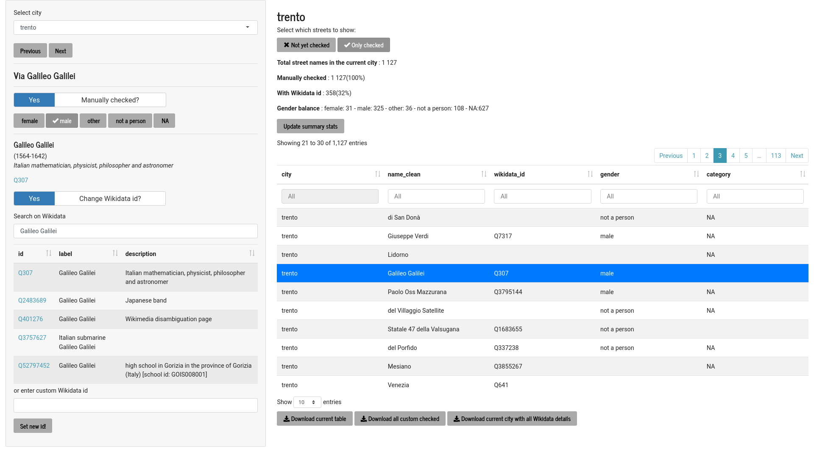

```{r setup, include=FALSE}
knitr::opts_chunk$set(echo = TRUE, fig.path = "static")
```


EDJNet has recently released the first pilot version of "[Mapping diversity](https://mappingdiversity.eu/)": it shows for the main city in each of Italy's regions how many streets are dedicated to men and women and includes details about who these streets were dedicated to. In a visually impressive format developed by [Sheldon.studio](https://sheldon.studio/) with text and analysis by [Alice Corona](https://twitter.com/alice_corona), it highlights that many more streets are dedicated to men than to women, and that many of those women are Catholic saints or other religious figures. 

This is an ambitious project, that required manually checking about 40&nbsp;000 street names and developing custom solutions, but is actually only the start of more ambitious edeavours still.

## How it started

The issue of gendered street names has received increasing attention in recent years. In Italy, for example, the association [Toponomastica femminile](https://www.toponomasticafemminile.com/) has an impressive and rather comprehensive database of all streets dedicated to women in the vast majority of Italy's municipalities that has been manually curated by volunteer contributors for years. 

A couple of years ago, in March 2019, I felt that it was worth working on tools that would make it possible to scale such efforts and visualise the result on a map. So I created a package for the R programming language, [`genderedstreetnames`](https://giocomai.github.io/genderedstreetnames/articles/genderedstreetnames.html), that would facilitate the process of extracting street names and showing the gender of individuals to whom streets are dedicated. The approach I used was functional, but I did not have the time to develop it further or to build useful outputs on it. 

In the meantime, a growing number of similar efforts have appeared, such as [Las Calles de las mujeres](https://geochicasosm.github.io/lascallesdelasmujeres/) and [Equal street names](https://equalstreetnames.org/).

They are both great, but they still largely depend on manually curated efforts done city by city. As I planned to get back working on this, I did so thinking more about scalability and adaptability: the final workflow would need to be easily scalable and amenable to deal with other dimensions, beyond gender. 

With this in mind, I created [`tidywikidatar`](https://edjnet.github.io/tidywikidatar/), an R package that facilitates getting data out of Wikidata in a tidy format, and used it for matching street names to individuals, in order to collect not only their gender, but also when they were born, their profession, etc. 

The final component part of the toolbox needed to facilitate a smooth replication of the process is an interactive web interface that makes it easy manually check and fix what automatic matching of street names and individuals got wrong. We have used such an interface internally for "[Mapping diversity](https://mappingdiversity.eu/)", but it is not yet quite ready for public consumption. We will get there in the coming months. Once that is ready, we will ensure easy distribution of the datasets thus generated and strive for compatibility with other existing initiatives. Hopefully, this will also encourage upstream contributions to Wikidata and OpenStreetMap when the data are incomplete.

In the meantime, I will outline all the steps taken to generate the data at the base of "[Mapping diversity](https://mappingdiversity.eu/)". The remaining part of this post is a slightly revised version of a [vignette](https://giocomai.github.io/genderedstreetnames/articles/genderedstreetnames.html) written for the package [`genderedstreetnames`](https://giocomai.github.io/genderedstreetnames/). The output is very similar, but the code is now based on more solid foundations.

## Step by step

In order to find out how many street are dedicated to men and how many to women, it is necessary to:

1. find a dataset that includes all street names of a given city or country
2. find out in a systematic (and ideally, at least partly automatic) way which of those streets are dedicated to persons, and among them which are dedicated to either a man or a woman.
3. manually check if the data gathered in the previous step are correct
4. visualise the results

The procedure described in this post addresses instances when a street is dedicated to a single person, and that person can be identified as either male or female. This reductionist approach is of course far from unproblematic, as it leaves out street names dedicated to more than a person, gendered groups of people, as well as people with non-binary gender identities (see a slightly longer elaboration of such considerations in the [about page of Mapping Diversity](https://mappingdiversity.eu/about/)). Yet it may provide useful inputs for a public conversation around gender and toponymy. Besides, this approach can still serve as a basis for alternative analyses.

This post makes extensive use of two packages built by this author, one for downloading and processing geographic files - [`latlon2map`](https://giocomai.github.io/latlon2map/) - and the other for searching, caching, and parsing Wikidata - [`tidywikidatar`](https://edjnet.github.io/tidywikidatar/), now on CRAN.

You can install them with the following commands:

```{r eval=FALSE}
install.packages("tidywikidatar")
# install.packages("remotes")
remotes::install_github(repo = "giocomai/latlon2map")
```

Before starting, let's load all required libraries.

```{r message=FALSE}
library("latlon2map") # for retrieving and processing geographic data
library("tidywikidatar") # for retrieving and processing Wikidata
library("dplyr") # for data wrangling
library("ggplot2") # for data visualisation
library("purrr") # for serialising data processing
library("progress") # progress bar to know how long we'll have to wait
library("sf") # for processing geographic data
library("tmap") # for plotting interactive maps more easily
```

Both `latlon2map` and `tidywikidatar` make it easy to cache data locally. If you don't set the cache folder, an `ll_data` and a `tw_data` folder will be created in your current working diretory. It may be useful to keep such files out of the project folder, in a location that makes stored data available to other projects that may rely on the same data. 

```{r message = FALSE}
ll_set_folder(path = "~/R/ll_data/")
tw_set_cache_folder(path = "~/R/tw_data/")
tw_enable_cache()
```

## Step 1: Get street names

There are different possible sources for street names. Relevant open data are often made available by national or local authorities. However, in order to have geolocalised street names, the most straightforward source is OpenStreetMap. 

As an example, I will process data on street names in Romania. You can make the same with other countries simply by changing the relevant parameter. The following command downloads the shapefile for OpenStreetMap data related to a given country from [Geofabrik's website](http://download.geofabrik.de/) in zip files. As usual, all credit for OpenStreetMap goes to ©OpenStreetMap contributors. 

```{r}
options(timeout = 600) # increase default timeout to enable download of bigger files
ll_osm_download(countries = "Romania")
```

To process data further, files related to roads need to be extracted from the zip file, which can conveniently be done with the dedicated function, `ll_extract_roads()`, and then loaded with `ll_osm_get_roads()`.

```{r message = FALSE}
ll_osm_extract_roads(countries = "Romania") # just takes the shapefiles of roads from the zip file
roads <- ll_osm_get_roads(country = "Romania") # loads them into R as an sf object
```


Let's focus on a single city.

For a start, we need the borders of the municipality we want to focus on. We will take the administrative borders from an EU database with all European municipalities (the database will be downloaded at first run, and then be cached locally). Let's take the city of Sibiu, in Transylvania. This is how the borders of the municipality look like:

```{r}
city_boundaries <- ll_get_lau_eu(name = "Municipiul Sibiu")
# run ll_get_lau_eu() to see all available locations

ggplot() +
  geom_sf(data = city_boundaries)
```

Oh, no! Sibiu is one of those cities with some speck of territory detached from the core part of its administrative boundaries! Let's focus on the town itself.

```{r}
city_boundaries <- city_boundaries %>%
  st_cast(to = "POLYGON") %>%
  mutate(area = st_area(geometry)) %>%
  dplyr::slice_max(area)

ggplot() +
  geom_sf(data = city_boundaries)
```

Much better.

We can now query our dataset, and find out which of all the streets and squares in Romania are located within the municipality of Sibiu. These are all the streets located in the municipality of Sibiu:


```{r}
city_streets <- roads %>%
  filter(st_within(
    x = roads,
    y = city_boundaries,
    sparse = FALSE
  ))

ggplot() +
  geom_sf(data = city_boundaries) +
  geom_sf(data = city_streets, size = 0.2)
```

Good. Now it's time to check out to what or whom these streets are dedicated.


## Step 2: find out which streets are dedicated to either a man or a woman


There are various approaches for facilitating the identification of the gender starting from names, and most of them use the first name as a hint.^[See for example the R package `gender` - https://github.com/ropensci/gender - for an approach based on historical data. See also the Python package `SexMachine` - https://pypi.org/project/SexMachine/ - which is also based on a database of names]

This is an option, but may lead to some mistakes. I propose to try first to match the name of person to a Wikidata id (after all, if a person has been entitled a street it is quite likely that they will also be on Wikipedia), and only if this does not work then fall back on different solutions. Besides, using Wikipedia should also allow to match cases when the database does not include the first name of the person to which it is dedicated (e.g. "Mozart street" is an easy one based on Wikidata, but would lead to no results based on the missing first name). Finally, using Wikipedia as a reference should not only lead to less mistakes, but provide also a brief characterisation of the individual which can then be used at a later stage in the analysis.

First, however, we need to "clean" street names in order to keep only the part of the street name that may potentially refer to a person. This is language specific and may involve removing the first or the last word. For example, this means removing "street" from "James Joyce Street" in order to look for "James Joyce" on Wikidata, which will correctly result in identifying the male Irish novelist and poet.

In the case of Romania, it is quite easy to deal with this issue, as it suffices to remove the first word of the street names:


```{r}
city_street_names <- city_streets %>%
  sf::st_set_geometry(NULL) %>%
  dplyr::filter(is.na(name) == FALSE) %>%
  dplyr::transmute(name,
    name_clean = stringr::str_remove(
      string = name,
      pattern = "\\w+\\b"
    ) %>%
      stringr::str_squish()
  ) %>%
  tidyr::drop_na() %>%
  dplyr::filter(nchar(name_clean) > 1)

head(city_street_names, n = 10) %>%
  knitr::kable()
```


Now we are ready to feed the street names to Wikidata and see if it can reliably determine to whom a given street or square is dedicated and their gender. The language parameter sets in which version of Wikidata the query is run, as results vary. Let's try first with a single name, one that clearly looks like a name: Vasile Aaron.

```{r}
tw_search(search = "Vasile Aaron", language = "ro") %>%
  knitr::kable()
```


Judging by the description, that looks like the person someone in Romania would dedicate a street to. 

Now we would like to have some information about this person, e.g. date of birth and death, and, of course, gender.

Thanks to the above query, we just found out that on Wikidata Vasile Aaron corresponds to "Q783587". See his page on [Wikidata](https://www.wikidata.org/wiki/Q783587) to get a glimpse of the kind of information available there. Each property has its code, so if we want to find out gender, we will have to ask for "P21". Let's give it a try:

```{r}
tw_get_property(id = "Q783587", p = "P21") %>%
  knitr::kable()
```

Oh no, we get back another "Q" identifiers! We'll need to get the label for this new code.

```{r}
tw_get_property(id = "Q783587", p = "P21") %>%
  tw_get_label()
```

Now this makes sense: entity with id "Q783587" has the value "Q6581097" for property "P31" actually means "the gender of Vasile Aaron is male". 

Let's move on and make a nice little function to get some more details:


```{r}
tw_get_bio <- function(id) {
  tibble::tibble(
    label = tw_get_label(id = id),
    description = tw_get_description(id = id),
    gender = tw_get_property(id = id, p = "P21") %>%
      dplyr::pull(value) %>% 
      tw_get_label(),
    year_of_birth = tw_get_property(id = id, p = "P569") %>%
      dplyr::pull(value) %>%
      lubridate::ymd_hms() %>%
      lubridate::year() %>%
      head(1) %>%
      as.character(),
    year_of_death = tw_get_property(id = id, p = "P570") %>%
      dplyr::pull(value) %>%
      lubridate::ymd_hms() %>%
      lubridate::year() %>%
      head(1) %>%
      as.character()
  )
}


tw_get_bio(id = "Q783587") %>% knitr::kable()
```


Nice! This mean that thanks to Wikidata we can get such nicely structured data for other folks who've been entitled a street. Let's try with someone more famous, and get some more details such if they have a Wikipedia page, as well as a picture:


```{r}

tw_get_bio <- function(id) {
  if (is.data.frame(id) == TRUE) {
    id <- id$id
  }
  gender_p <- tw_get_property(id = id, p = "P21") %>%
    dplyr::pull(value)
  if (length(gender_p) == 0) {
    gender <- as.character(NA)
  } else if (is.na(gender_p)) {
    gender <- as.character(NA)
  } else {
    gender <- tw_get_label(gender_p)
  }

  year_of_birth <- tw_get_property(id = id, p = "P569") %>%
    dplyr::pull(value) %>%
    lubridate::ymd_hms() %>%
    lubridate::year() %>%
    head(1) %>%
    as.character()

  if (length(year_of_birth) == 0) {
    year_of_birth <- as.character(NA)
  }

  year_of_death <- tw_get_property(id = id, p = "P570") %>%
    dplyr::pull(value) %>%
    lubridate::ymd_hms() %>%
    lubridate::year() %>%
    head(1) %>%
    as.character()

  if (length(year_of_death) == 0) {
    year_of_death <- as.character(NA)
  }


  tibble::tibble(
    id = id,
    label = tw_get_label(id = id),
    description = tw_get_description(id = id),
    gender = gender,
    year_of_birth = year_of_birth,
    year_of_death = year_of_death,
    picture = tw_get_image(id = id)[1],
    wikipedia = tw_get_wikipedia(
      id = id,
      language = "en"
    )
  )
}


eminescu_tw <- tw_search("Mihai Eminescu") %>%
  tw_filter_first(p = "P31", q = "Q5") %>%
  # tw_filter_first() instead of tw_filter() to get one result only
  dplyr::pull(id) %>%
  tw_get_bio()

eminescu_tw %>%
  tidyr::pivot_longer(
    cols = dplyr::everything(),
    names_to = "property",
    values_to = "value"
  ) %>%
  knitr::kable()
```

```{r results='asis'}
cat("")
```


Now let's replicate this for all the `r scales::number(length(unique(city_street_names$name_clean)))` unique street names found in Sibiu and see the result with a random sample of streets. 


```{r eval=TRUE, warning = FALSE, message = FALSE}

# I'll still use the above-created tw_get_bio() for clarity,
# but it would be more efficient to run tw_get with all ids,
# and then filter results

pb <- progress::progress_bar$new(total = length(unique(city_street_names$name_clean)))

streetnames_bio <-
  purrr::map_dfr(
    .x = unique(city_street_names$name_clean),
    .f = function(current_name) {
      pb$tick()
      search_result <- tw_search(
        search = current_name,
        language = "ro"
      ) %>%
        dplyr::filter(is.na(id) == FALSE) %>%
        tw_filter_first(p = "P31", q = "Q5")
      # print(current_name)
      # print(search_result$id)
      if (nrow(search_result) == 0 | length(search_result) == 0) {
        NULL
      } else {
        search_result %>%
          tw_get_bio() %>%
          dplyr::mutate(name_clean = current_name)
      }
    }
  ) %>%
  dplyr::distinct()


streetnames_bio %>%
  dplyr::slice_sample(n = 6) %>%
  dplyr::select(-name_clean) %>%
  knitr::kable()
```


For a completely automatic method that can easily be run on thousands of streets the above is not too bad, but it still contains a fair share of errors. My favourite is "Strada teilor" - "Linden street" (in [reference to trees](https://en.wikipedia.org/wiki/Tilia)), being understood as "Taylor Swift street". Bizzarre? Certainly, but also helpful as a reminder of how this all works: the search matches also common ways English terms would be misspelled. "Teilor", the genitive plural of "Tei", linden, may be how one would write "Taylor" if they had no clue about how English is written.


## Step 3: Manually fixing what's not right


If we look at the result, the vast majority of matches are correct.

Some results  may be missing because they actually don't exist on Wikidata. Other, because the search string for some reason did not work. 

Either way, there is likely some manual work to do to get this right. 


In the old package `genderedstreetnames`, I had a very basic interface that made it super-quick to check the output and fix the gender column. 


Things get more complicated if we want to facilitate matching with Wikidata ids. This is the interface we used to manually check matches for the pilot of [Mapping diversity](https://mappingdiversity.eu/):




In most cases, it's sufficient to just keep on clicking on "next", until a mismatch is found. Then it's possible to search Wikidata from within the interface and assign the id to the given street name. A more flexible version of this interface will be made publicly available in the coming months. 

In the meantime, let's proceed with the manually fixed results. 


```{r message = FALSE, warning = FALSE}
city_streets_bio_sf <-
  city_streets %>%
  dplyr::left_join(
    y = city_street_names %>%
      dplyr::left_join(y = streetnames_bio, by = "name_clean"),
    by = "name"
  )

city_streets_bio_sf %>%
  sf::st_drop_geometry() %>%
  dplyr::select(name_clean, id, label, description) %>%
  distinct(name_clean, .keep_all = TRUE) %>%
  readr::write_csv(file = "city_street_names_pre_check.csv")


## actually fix results and store them in "city_street_names_post_check.csv"
## just fix the id column with the correct wikidata id
## or set it to NA if none should apply

if (fs::file_exists("city_street_names_post_check.csv")) {
  fixed_city_street_names <- readr::read_csv(
    file = "city_street_names_post_check.csv",
    col_types = readr::cols(
      name_clean = readr::col_character(),
      id = readr::col_character(),
      label = readr::col_character(),
      description = readr::col_character()
    )
  ) %>%
    dplyr::select(name_clean, id) %>%
    dplyr::filter(is.na(id) == FALSE)

  pb <- progress::progress_bar$new(total = length(fixed_city_street_names$id))

  streetnames_bio_fixed <-
    purrr::map_dfr(
      .x = seq_along(fixed_city_street_names$id),
      .f = function(x) {
        pb$tick()
        fixed_city_street_names$id[x] %>%
          tw_get_bio() %>%
          dplyr::mutate(name_clean = fixed_city_street_names$name_clean[x])
      }
    ) %>%
    dplyr::distinct()

  city_streets_bio_sf <-
    city_streets %>%
    dplyr::left_join(
      y = city_street_names %>%
        dplyr::left_join(
          y = streetnames_bio_fixed,
          by = "name_clean"
        ),
      by = "name"
    )
}
```


So here's the tally of streets dedicated to men and women after making sure Wikidata identifiers actually match the street name.

```{r}
city_streets_bio_sf %>%
  sf::st_drop_geometry() %>%
  distinct(name, .keep_all = TRUE) %>%
  count(gender) %>%
  knitr::kable()
```


And here's a full list of all streets dedicated to women in Sibiu:

```{r}
city_streets_bio_sf %>%
  sf::st_drop_geometry() %>%
  distinct(name, .keep_all = TRUE) %>%
  dplyr::filter(gender == "female") %>%
  dplyr::select(name, id, label, description) %>%
  knitr::kable()
```


## Step 4: visualise the result on a map

Here's a map of Sibiu showing the gender distribution of people of who have been dedicated streets.

```{r}
ggplot2::ggplot() +
  geom_sf(data = city_boundaries) +
  geom_sf(
    data = city_streets_bio_sf %>%
      filter(is.na(gender)),
    size = 0.2, colour = "grey"
  ) +
  geom_sf(
    data = city_streets_bio_sf %>%
      filter(is.na(gender) == FALSE),
    size = 0.5,
    mapping = ggplot2::aes(colour = gender)
  ) +
  # scale_color_brewer(type = "div",
  #                    palette = "Set1",
  #                    na.value = "grey") +
  scale_color_manual(values = c("#a6ce39", "#6f2c91"),
                     na.value = "grey") +
  theme_void() +
  theme(legend.title = element_blank())
```


We can of course colour-code by some other feature, such as year of birth:

```{r}
city_streets_bio_birth_sf <-
  city_streets_bio_sf %>%
  dplyr::mutate(year_of_birth = as.numeric(year_of_birth)) %>%
  dplyr::mutate(
    birth =
      dplyr::case_when(
        year_of_birth > 1900 ~ "20th century",
        year_of_birth > 1800 ~ "19th century",
        year_of_birth > 1700 ~ "18th century",
        is.na(year_of_birth) == FALSE ~ "earlier",
        TRUE ~ as.character(NA)
      )
  ) %>%
  dplyr::mutate(birth = factor(birth, levels = c(
    as.character(NA),
    "earlier",
    "18th century",
    "19th century",
    "20th century"
  )))
```


```{r}


ggplot2::ggplot() +
  geom_sf(data = city_boundaries) +
  geom_sf(data = city_streets_bio_birth_sf %>%
    filter(is.na(birth) == TRUE), colour = "grey", alpha = 0.7, size = 0.2) +
  geom_sf(
    data = city_streets_bio_birth_sf %>%
      filter(is.na(birth) == FALSE),
    size = 0.3,
    mapping = ggplot2::aes(colour = birth)
  ) +
  scale_color_viridis_d() +
  theme_void() +
  theme(legend.title = element_blank())
```

It appears that a lot of streets are dedicated to 19th century figures. 

```{r}
city_streets_bio_birth_sf %>%
  sf::st_drop_geometry() %>%
  distinct(name, .keep_all = TRUE) %>%
  count(birth) %>%
  knitr::kable()
```

It is worth highlighting that this outlook has changed many times... Until the first world war, Sibiu was part of the Habsburg empire; it then became part of independent Romania, but in the [early 1930s](https://en.wikipedia.org/wiki/Sibiu#Demographics) local Germans ([Transylvanian Saxons](https://en.wikipedia.org/wiki/Transylvanian_Saxons)) still outnumbered Romanians ([see a map of the time](https://testzone.giorgiocomai.eu/sibiu1934/)). Toponomastics changed again under the years of the "people's" (and then "socialist") republic, to be changed again after 1989.


```{r eval = FALSE}
tmap::tmap_mode(mode = "plot")

city_map <- tmap::tm_shape(city_boundaries) +
  tmap::tm_polygons() +
  tmap::tm_shape(city_streets_bio_sf) +
  tmap::tm_lines(col = "gender", palette = "Set1", textNA = "other")

city_map
# tmap::tmap_save(city_map, "gendered_street_city.png")
```


Let's have a closer look with an interactive version of this map. Click on the streets to see more details in the popup. 

```{r warning=FALSE, message = FALSE}
tmap::tmap_mode("view")

interactive_tmap <- tmap::tm_shape(city_boundaries, name = "Administrative boundary") +
  tmap::tm_fill(
    col = "lightblue",
    alpha = 0.2,
    popup.vars = FALSE,
    legend.show = FALSE,
    interactive = FALSE
  ) +
  # tmap::tm_shape(city_streets_bio_sf %>%
  #   dplyr::filter(is.na(gender) == TRUE),
  # name = "Streets not dedicated to persons"
  # ) +
  # tmap::tm_lines(
  #   interactive = FALSE,
  #   legend.show = FALSE,
  #   alpha = 0.2,
  #   colorNA = "grey30"
  # ) +
  tmap::tm_shape(city_streets_bio_sf %>%
    dplyr::filter(is.na(gender) == FALSE),
  name = "Streets dedicated to persons"
  ) +
  tmap::tm_lines(
    col = "gender",
    lwd = 3,
    palette = c("#a6ce39", "#6f2c91"),
    textNA = "other",
    id = "name",
    popup.vars = c(
      "gender",
      "description",
      "year_of_birth",
      "year_of_death",
      "wikipedia"
    )
  )

tmap_save(tm = interactive_tmap, filename = "interactive_tmap.html")

```

<iframe src="interactive_tmap.html" data-external="1" height="405" width="720"></iframe>

And... that's a wrap for today. Hopefully all of the above will provide a better understanding of how we have collected and verified data for the pilot of [Mapping diversity](https://mappingdiversity.eu/). In the coming months we will publicly release the above-mentioned interface to facilitate Wikidata matching, as well as provide an easy way to share the resulting datasets. Stay tuned!
