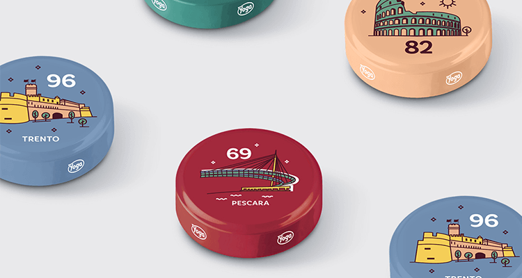
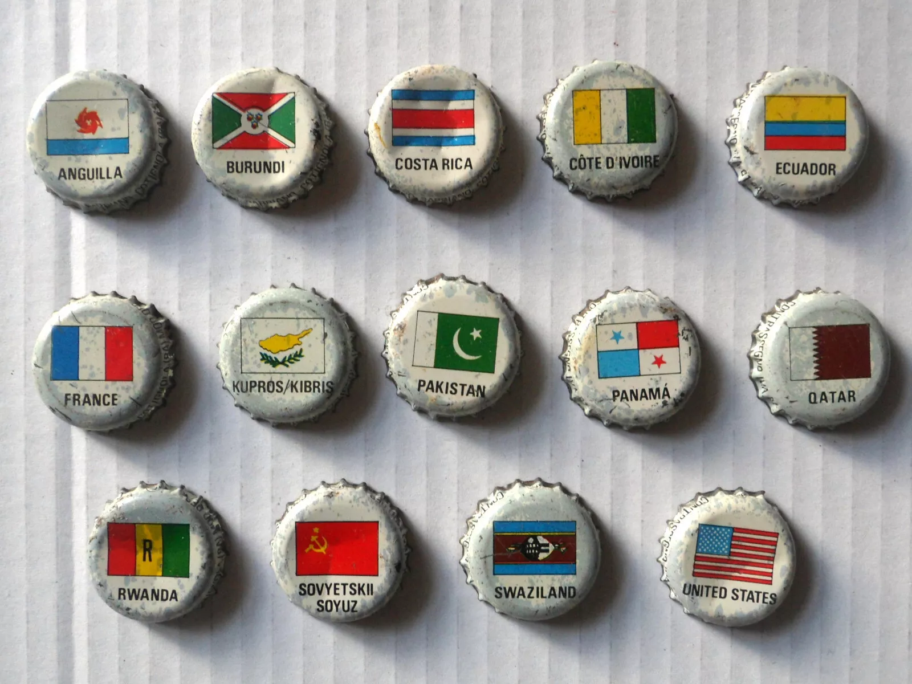

```{r setup, include=FALSE}
knitr::opts_chunk$set(echo = FALSE, fig.path = "static")
#library("dplyr")
library("sf")
set.seed(2024-9-17)
```

Following this post, you will find out how to:

- match province identifiers to a map (easy!)
- make a palette based on the prevalent colour of a set of images (easier than I thought)
- place a set of png images on a ggplot canvas (the trick part is adapting size to the number of caps)
- place png images on an interactive `leaflet` map (always fancy)
- estimate how many bottles of juice you're supposed to drink in order to finish your collection (serious questions)
- build a `wasm`-based, server-less shiny app with all of the above (so much wisdom can't be accessible only to those who code)

<hr />

In May 2024, Italian brand "Yoga" has started to place on caps of its small glass bottles of fruit juice a set of decorations themed after Italian cities (["Tutte le mie città"](https://www.succhiyoga.it/collezione-tappi-succhi-yoga-tutte-mie-le-citta/)). The full set includes 107 different caps, one for each Italian province. 



The design is quite nice, and for someone with kids, a good occasion to get to know better Italy's geography, including the location of somewhat smaller - or just distant - cities. How is the geographic coverage of our collection going? At the same time, it's also an obvious occasion to talk about statistics: how many fruit juice bottles will we have to drink in order to have a full set, considering that bottles are sold in cartons of 6, each with random caps?

As you see, big questions. 

So, if you will indulge me...

## Which parts of Italy does our collection cover?

Frmo the very beginning, things bode well. Each cap has the name of the pronvicial capital(s) and a number, from 1 to 107. The numbering does not correspond to the one used by the Italian statistical office, but places cities in alphabetical order, so it's an easy fix.

We can take the official dataset with administrative boundaries [from ISTAT's website](https://www.istat.it/notizia/confini-delle-unita-amministrative-a-fini-statistici-al-1-gennaio-2018-2/), distributed with a [CC-BY license](https://creativecommons.org/licenses/by/4.0/deed.en), and we're immediately ready to match caps to administrative boundaries.

```{r get ISTAT provinces}
provinces_sf_path <- fs::path("data", "provinces_sf.rds")

if (fs::file_exists(provinces_sf_path)==FALSE) {
  
fs::dir_create("zip")
zip_path <- fs::path("zip", "Limiti01012024_g.zip")
if (fs::file_exists(path = zip_path)==FALSE) {
  download.file(url = "https://www.istat.it/storage/cartografia/confini_amministrativi/generalizzati/2024/Limiti01012024_g.zip",
                destfile = zip_path,
                method = "wget")
}

fs::dir_create("shp")
unzip(zipfile = zip_path, exdir = "shp")

provinces_sf <- sf::st_read(dsn = fs::path("shp", "Limiti01012024_g", "ProvCM01012024_g")) |> 
  dplyr::select(COD_PROV, DEN_UTS, SIGLA) |> 
  dplyr::rename(id = COD_PROV, 
                name = DEN_UTS,
                code = SIGLA) |> 
  dplyr::arrange(name) |> 
  dplyr::mutate(id = as.character(dplyr::row_number())) |> 
  tidyr::unite(col = "id_name_combo", id, name, sep = "\n", remove = FALSE) |> 
  sf::st_as_sf()

fs::dir_create("data")
saveRDS(object = provinces_sf,
        file = provinces_sf_path)
}

provinces_sf <- readRDS(provinces_sf_path)
```


Let's take a random sample of six caps, and place them on a map, adding the respective label:

```{r selected_caps_provinces_sf}
caps_id <- sample(1:107, size = 6, replace = FALSE)

selected_caps_provinces_sf <- provinces_sf |> 
  dplyr::filter(is.element(id, caps_id))
```


```{r basic aquamarine map selected}


ggplot2::ggplot(selected_caps_provinces_sf) +
  ggplot2::geom_sf(data = provinces_sf,
                   fill = "grey95",
                   colour = "grey80") +
  ggplot2::geom_sf(fill = "aquamarine") +
  ggplot2::geom_sf_text(mapping = ggplot2::aes(label = id_name_combo), 
                        family = "Roboto Condensed",
                        fontface = "bold",
                        lineheight = 0.8) +
  ggplot2::theme_void(base_family = "Roboto Condensed") +
  ggplot2::scale_fill_identity(guide = "none")
```
With labels... nice and easy! If we had all provinces we'd probably need to include only the province id and not the name, or just fill the area without code, but there's not much we can do about it 

There is however, something that is deeply unsatisfying: the fill colour of the provinces.

And the good thing is, there is a satisfying answer to this question: each of the caps has one of small sets of background colours... overall, a nice palette. Shouldn't all provinces take the colour from the respective cap? Of course they should!

## Getting the background colour of each cap

Manually retrieving the backgroun colour of 107 caps would be more than these typing-loving hands would be willing to accept, so, an alternative solution must be found.

And indeed, we are in good luck: the website of the initiative hosts not one, but two full sets of of images of caps! Even better, they are hosted with predictable names:

- higher resolution 3d render of caps (see e.g. [cap 1](https://www.succhiyoga.it/wp-content/themes/timber-starter-theme/static/special/citta/images/tappi-big/1.png), and adjust the filename to see the following)
- lower resolution 2d render of caps (see e.g. [cap 1](https://www.succhiyoga.it/wp-content/themes/timber-starter-theme/static/special/citta/images/tappi/1.png), and adjust the filename to see the following)

Let's retrieve them all, as we'll need them for reference. 

```{r retrieve caps pics}

fs::dir_create("png_big")

purrr::walk(
  .x = as.character(1:107),
  .f = function(i) {
    url <- stringr::str_c("https://www.succhiyoga.it/wp-content/themes/timber-starter-theme/static/special/citta/images/tappi-big/",
                          i,
                          ".png")
    
    local_path <- fs::path("png_big", fs::path_ext_set(i, "png"))
    
    if (fs::file_exists(local_path)==FALSE) {
      download.file(url = url, destfile = local_path)
      Sys.sleep(1)
    }
    
  })

fs::dir_create("png_small")

purrr::walk(
  .x = as.character(1:107),
  .f = function(i) {
    url <- stringr::str_c("https://www.succhiyoga.it/wp-content/themes/timber-starter-theme/static/special/citta/images/tappi/",
                          i,
                          ".png")  
    
    local_path <- fs::path("png_small", fs::path_ext_set(i, "png"))
    
    if (fs::file_exists(local_path)==FALSE) {
      download.file(url = url, destfile = local_path)
      Sys.sleep(1)
    }
    
  })

```


```{r build_set function}

build_set <- function(caps_id) {
  
n_caps <- length(caps_id)
n_rows <- sqrt(n_caps) |> 
  floor()
n_cols <- sum(n_rows, 1)

tibble::tibble(
  id = caps_id,
  row = rep(1:n_rows, n_cols), 
  column = rep(1:n_cols, n_rows)
) |> 
  tidyr::drop_na() |> 
  dplyr::mutate(dplyr::across(dplyr::everything(), as.character)) |> 
  dplyr::mutate(png_small = fs::path("png_small", fs::path_ext_set(as.character(id), "png")),
                png_big = fs::path("png_big", fs::path_ext_set(as.character(id), "png"))) 
}

plot_set <- function(caps_id, version = "small", cap_size = 0.4) {
  
  if (version == "small") {
    build_set(caps_id = caps_id) |>   
    ggplot2::ggplot() +
    ggimage::geom_image(
      mapping = ggplot2::aes(x = column,
                             y = row,
                             image = png_small), 
      size = cap_size) +
    ggplot2::theme_void()
  } else {
    build_set(caps_id = caps_id) |>   
    ggplot2::ggplot() +
    ggimage::geom_image(
      mapping = ggplot2::aes(x = column,
                             y = row,
                             image = png_big), 
      size = cap_size) +
    ggplot2::theme_void()
  }
  
  
}

```
And let's have a look at the above-selected random set of caps, first in the basic version:

```{r test_set png_small}
plot_set(caps_id = caps_id, version = "small", cap_size = 0.4)
```
then in the high resolution one:


```{r test_set png_big}
plot_set(caps_id = caps_id, version = "big", cap_size = 0.4)

```

These are really very nicely designed!

Anyway... here's what we have achieved so far. Based on a set of cap identifiers, we can:

- create a map and show the provinces corresponding to the selected caps
- preview the caps themselves as a picture

The next task of the masterplan is to identify the background colour of each cap, in order to use it when showing selected provinces on the map. 


[TO DO: post in progress - I've actually done most of the coding for everything announced on top of the post, I just need the time to write up the accompanying text]

---

P.S. if you're reading this from Italy, and you have some active memories from the last century... you may remember how another established fruit juice company used to run a somewhat similar campaign: caps with country flags. Let me unlock this memory for you, with this [picture from ebay](https://www.ebay.it/itm/186188673705).

{width=100%}