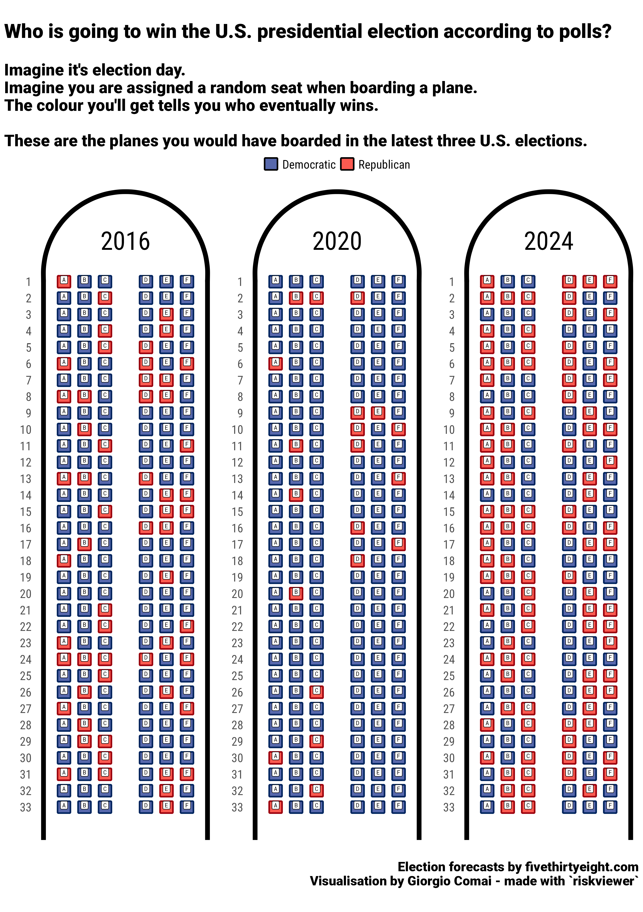

*Here are 538's final forecasts for recent elections, shown as if for a seating chat for a booking system of an airline.*


Source for election forecast data, fivethirtyeight.com:

- [2016](https://projects.fivethirtyeight.com/2016-election-forecast/)
- [2020](https://projects.fivethirtyeight.com/2020-election-forecast/)
- [2024](https://projects.fivethirtyeight.com/2024-election-forecast/)


These include also the unlikely chance of none of the sides reaching 270 electoral college seats (mostly, because of 768 parity, but plausibly, because of 1 or more electoral college seats going to third party candidates). As in most years the chance appears close to 0.2%, they have been removed from the visualisation: only one seat every couple of planes would need to be reserved for that specific scenario.


```{r source_data, echo=FALSE}
forecast_df <- tibble::tribble(~year, ~D, ~R, ~N, 
                               2016, 0.714-0.005, 0.286-0.005, 0.01,
                               2020, 0.8916, 0.1039, 0.0045,
                               2024, 504/1000, 494/1000, 2/1000) |> 
  dplyr::arrange(year)

forecast_df |> 
  dplyr::mutate(dplyr::across(D:N, scales::percent)) |> 
  knitr::kable()
```


```{r forecast, echo = FALSE}
forecast_ratio_list <- forecast_df |> 
  dplyr::mutate(D = D+N/2, 
                R = R+N/2) |> 
  dplyr::select(-N) |> 
  dplyr::rename(Democratic = D, Republican = R) |> 
  #dplyr::slice(1) |> 
  tidyr::pivot_longer(cols = Democratic:Republican, names_to = "Risk", values_to = "Ratio") |> 
  dplyr::group_split(year, .keep = FALSE)


names(forecast_ratio_list) <- unique(forecast_df$year)
```


```{r fig.width=14, fig.height=14, fig.align='center', eval = FALSE, echo = FALSE}

plots_l <- purrr::map(
  .x = names(forecast_ratio_list),
  .f = \(current_year) {
    rv_create_airplane(risk_ratio = forecast_ratio_list[[current_year]],
                       title = current_year,
                       fill = c("#5768ac", "#fa5a50"),
                       font_family = "Roboto Condensed",
                       font_family_seats = "Roboto Mono",
                       legend_position = "top")
  }
)

plane_combo_gg <- plots_l  |> 
  patchwork::wrap_plots(
    guides = "collect"
  ) +
 plot_annotation(
  title = "Who is going to win the U.S. presidential election according to polls?",
  subtitle = "
Imagine it's election day.  
Imagine you are assigned a random seat when boarding a plane.
The colour you'll get tells you who eventually wins.

These are the planes you would have boarded in the latest three U.S. elections.",
  caption = 'Election forecasts by fivethirtyeight.com\nVisualisation by Giorgio Comai - made with `riskviewer`',
  theme = ggplot2::theme(
    title = ggplot2::element_text(
      size = 22,
      family = "Roboto Black"),
    text = ggplot2::element_text(
      family = "Roboto Condensed")
    )
) &
  ggplot2::theme(legend.position = "top") 
  
ggplot2::ggsave(filename = "plane_combo.png",
                plot = plane_combo_gg,
                width = 12,
                height = 17,
                bg = "white")

```


{width=100%}

For more context, see:

- [Visualising risk: a modern implementation of the Risk Characterisation Theatre](/2021/04/29/visualising-risk-a-modern-implementation-of-the-risk-characterisation-theatre/)
- [`riskviewer` R package used to generate this visualisation](https://edjnet.github.io/riskviewer/)