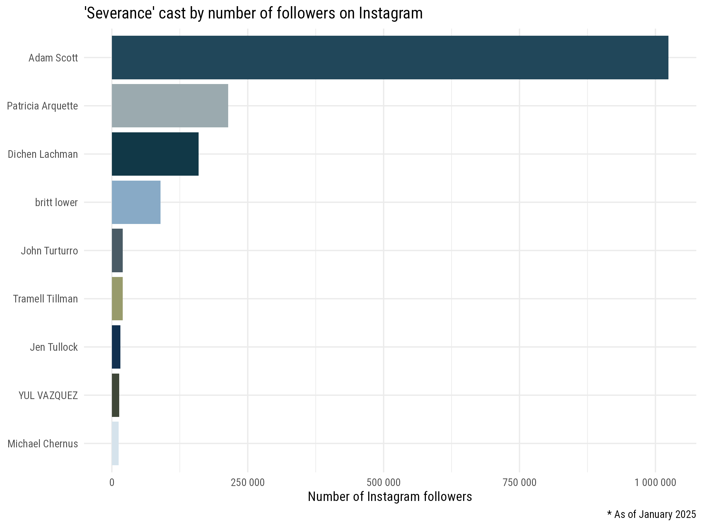
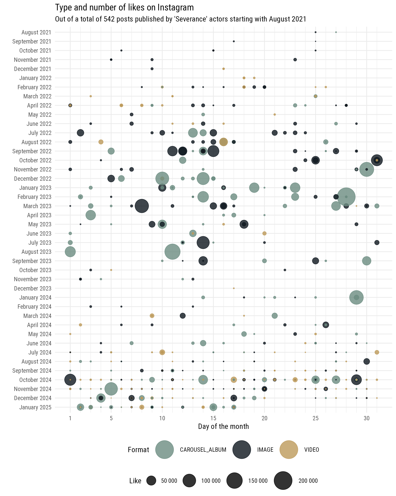

## A preliminary note

This post largely relies on package for the R programming language I've been working on, that is still under development. Its name is [`cornucopia`](https://giocomai.github.io/cornucopia/). Why call it cornucopia? It's a tongue in cheek reference to marketers always thinking about conversion funnels: ultimately, a cornucopia is like a funnel that keeps on giving. Also known as the “horn of plenty”, it’s basically a marketer's wildest dream: a funnel that endlessly overflows with abundance.

More seriously: the package is [available on GitHub](https://giocomai.github.io/cornucopia/) and I've put some efforts in documenting it. Many functions can be used and are effectively being used, but overall given then breadth of the Meta API it remains very much a work in progress: only some use cases are covered; are not yet adequately documented; only some functions have effectively integrated efficient caching. But if you're approaching the Meta/Facebook/Instagram graph API for the first time, I'll say that overcoming the Byzantine system required to get an app up and running and then retrieving appropriately- scoped tokens will probably be more of a challenge than incomplete documentation in `cornucopia`. You have been warned. In due time, documentation will get better, I may get to write a few tutorials, and who knows, perhaps even make the app public. Until then... just enjoy this light-hearted post showcasing the `business discovery` Instagram API.


```{r setup, echo=TRUE, message=FALSE, warning=FALSE}
knitr::opts_chunk$set(echo = TRUE, message = FALSE, warning = FALSE)

# if not available, install `cornucopia` with pak::pak("giocomai/cornucopia")
# the package is still experimental and not fully-featured or documented, yet
library("cornucopia")

start_date <- "2025-01-01"
end_date <- "2025-01-18"

# this is how I protect tokens for this session, adapt this as needed
keyring::keyring_unlock(password = readr::read_lines("key.txt"), keyring = "codebase")

cc_set(
  start_date = start_date,
  end_date = end_date,
  ig_user_id = keyring::key_get(service = "ig_user_id", username = "cornucopiar", keyring = "codebase"),
  fb_user_token = keyring::key_get(service = "fb_long_user_token", username = "giocomai", keyring = "codebase"),
  fb_user_id = keyring::key_get(service = "fb_user_id", username = "giocomai", keyring = "codebase")
)

library("dplyr")
library("ggplot2")
# pak::pak("ivelasq/severance")
library("severance")

theme_set(theme_minimal(base_family = "Roboto Condensed"))
```


## Step 1: Retrieve the Instagram handles of *Severance* actors

First, we need to retrieve the Instagram handles of *Severance* actors. Rather than add them manually, we'll query Wikidata via Wikipedia. Why? Because if you want to repeat this post with a different TV series or film the only thing you'll need to do is to change the URL to the Wikipedia page in the following code chunk or the [version of this post including code chunks](https://github.com/giocomai/codebase-blog/tree/master/content/post/2025-01-19-severance_launch_on_instagram/), and all the rest will follow automagically. 


```{r actors_ig_df}
library("tidywikidatar")
tw_create_cache_folder(ask = FALSE)
tw_enable_cache()

actors_ig_df <- tw_get_wikipedia_page_qid(url = "https://en.wikipedia.org/wiki/Severance_(TV_series)") |> 
  dplyr::pull(qid) |> 
  tw_get_property(p = "P161") |> 
  dplyr::transmute(actor_qid = value) |> 
  dplyr::mutate(actor_name = tw_get_label(actor_qid)) |> 
  dplyr::mutate(ig_username = tw_get_p1(actor_qid, p = "P2003"))

knitr::kable(
  actors_ig_df |> 
    dplyr::select(-actor_qid) |> 
    dplyr::mutate(ig_username = purrr::map_chr(
      .x = ig_username, .f = \(x) {
        if (is.na(x)) {
          "/"
        } else {
          htmltools::a(x, href = stringr::str_c("https://www.instagram.com/", x, "/")) |> as.character()
        }
      })), escape = FALSE)
```

Alright, not all of the cast has an Instagram account, but most do. Let's proceed and check some info about their Instagram accounts.

```{r actors_ig_no_na_df}
actors_ig_no_na_df <- actors_ig_df |> 
  tidyr::drop_na(ig_username)
```

## Step 2: Check out how many followers they have

In order to proceed, we'll rely on the ["business discovery" feature](https://developers.facebook.com/docs/instagram-platform/instagram-graph-api/reference/ig-user/business_discovery/) of the official Instagram API. To do so, you'll need to have a business Instagram account associated with a Facebook page and get an appropriately scoped token: getting this right is a bit of a pain at first, but [follow along this documentation](https://giocomai.github.io/cornucopia/#meta--facebook--instagram) and you'll eventually get there. Notice that for this endeavour you'll only need a `fb_user_token` (not the page token) and an `ig_user_id` (you'll need to retrieve it through the API, is not the old Instagram id).

```{r cast_ig_df}
if (fs::file_exists("cast_ig_df.csv")==FALSE) {
  # cornucopia will eventually take care of the caching itself, but for the time being, we'll handle this manually
  # also: we want to cache the data at the moment this post is written
  cast_ig_df <- cc_get_instagram_bd_user(ig_username = actors_ig_no_na_df$ig_username) |> 
    dplyr::select(-id)
  readr::write_csv(x = cast_ig_df, file = "cast_ig_df.csv")
}

cast_ig_df <- readr::read_csv("cast_ig_df.csv", show_col_types = FALSE, progress = FALSE)

```

Let's see some basic stats about their Instagram accounts:

```{r cast_ig_df table}
cast_ig_df |> 
  dplyr::select(username, name, followers_count, follows_count, media_count) |> 
  dplyr::mutate(username = purrr::map_chr(
    .x = username, .f = \(x) {
      htmltools::a(x, href = stringr::str_c("https://www.instagram.com/", x, "/")) |> as.character()
    })) |> 
  dplyr::arrange(dplyr::desc(followers_count)) |> 
  knitr::kable(escape = FALSE, format.args = list(big.mark = " "))
```

Not bad, Adam Scott, with over 1 million followers, not bad. Some of them post very occasionally, judging by the total number of posts. 

```{r}
instagram_followers_gg <- cast_ig_df |> 
  dplyr::select(username, name, followers_count) |> 
  dplyr::arrange(followers_count) |> 
  dplyr::mutate(name = forcats::fct_inorder(name)) |> 
  ggplot() +
  geom_col(mapping = aes(x = followers_count,
                         y = name,
                         fill = username)) +
  scale_fill_manual(values = c(severance_palette("Dinner"), severance_palette("Hell"))) +
  scale_x_continuous(name = "Number of Instagram followers",
                     labels = scales::number) +
  scale_y_discrete(name = NULL) +
  labs(title = paste(sQuote("Severance"), "cast by number of followers on Instagram"),
       caption = "* As of January 2025") +
  theme(legend.position = "none")

ggplot2::ggsave(filename = "instagram_followers_gg.png",
                plot = instagram_followers_gg,
                width = 8,
                height = 6,
                bg = "white")

```
{width=100%}

Time to see what they post.

## Step 3: Retrieve their posts

Instagram has set a rather heavy throttling of this API endpoint to prevent scraping, so we'll just retrieve the latest 100 post of each actor. Ultimately, API limits are reset after 1 hour, so adding some waiting time this can be scaled up to a reasonable extent for many use cases. 

```{r}
# manual caching, as long as I don't integrate proper caching in the core functions
base_media_folder <- fs::dir_create("ig_media")

media_df <- purrr::map(
  .x = cast_ig_df$username,
  .f = \(current_username) {
    current_filename <- fs::path(base_media_folder, fs::path_ext_set(path = current_username,
                                                                     ext = "csv") |> 
                                   fs::path_sanitize())
    if (fs::file_exists(current_filename)==FALSE) {
      current_media_df <- cc_get_instagram_bd_user_media(
        ig_username = current_username,
        max_pages = 4 # 4 pages, as each page has 25 posts
      )
      # dropping thumbnail and media url, as they are attached to my user and anyway stop working soon
      readr::write_csv(x = current_media_df |> 
                         dplyr::select(-thumbnail_url, -media_url),
                       file = current_filename)
    }
    current_media_df <- readr::read_csv(current_filename, show_col_types = FALSE, progress = FALSE)
    current_media_df
  }
) |> 
  purrr::list_rbind()


```

## Step 4: check out what they post

So here we are, with about 100 posts per user, or much less for those who post infrequently. As you see, retrieving 100 posts lets us go back in time just a couple of months for a couple of users, but all the way back to 2015 for others!

```{r}
usernames_ordered_df <- cast_ig_df |> 
  dplyr::select(username)

usernames_ordered_df |> 
  dplyr::left_join(
    media_df |> 
      dplyr::group_by(username) |> 
      dplyr::count(name = "post"),
    by = "username") |>
  dplyr::left_join(y = media_df |> 
                     dplyr::group_by(username) |> 
                     dplyr::summarise(earliest_post  = min(timestamp) |> as.Date(),
                                      latest_post = max(timestamp) |> as.Date()),
                   by = "username") |> 
  dplyr::left_join(y = media_df |> 
                     dplyr::group_by(username, media_type) |> 
                     dplyr::count() |> 
                     tidyr::pivot_wider(names_from = media_type, values_from = n), 
                   by = "username") |> 
  dplyr::left_join(y = media_df |> 
                     dplyr::group_by(username, media_product_type) |> 
                     dplyr::count() |> 
                     tidyr::pivot_wider(names_from = media_product_type, values_from = n), 
                   by = "username") |> 
  
  knitr::kable()

```

N.B. All posts - in Instagram API parlance, we are actually talking about `media` items - are either "feed" or "reel", and, separately, either carousel, image, or video.


## Step 5: Time to focus on their Severance posts

Do they post about *Severance*?

```{r severance_media_df}
severance_media_df <- media_df |> 
  dplyr::filter(stringr::str_detect(string = caption,
                                    pattern = stringr::fixed(pattern = "severance",
                                                             ignore_case = TRUE)))


usernames_ordered_df |> 
  dplyr::left_join(
    severance_media_df |> 
      dplyr::group_by(username) |> 
      dplyr::count(name = "post"),
    by = "username") |>
  dplyr::left_join(y = severance_media_df |> 
                     dplyr::group_by(username) |> 
                     dplyr::summarise(earliest_post  = min(timestamp) |> as.Date(),
                                      latest_post = max(timestamp) |> as.Date()),
                   by = "username") |> 
  dplyr::left_join(y = severance_media_df |> 
                     dplyr::group_by(username, media_type) |> 
                     dplyr::count() |> 
                     tidyr::pivot_wider(names_from = media_type, values_from = n), 
                   by = "username") |> 
  dplyr::left_join(y = severance_media_df |> 
                     dplyr::group_by(username, media_product_type) |> 
                     dplyr::count() |> 
                     tidyr::pivot_wider(names_from = media_product_type, values_from = n), 
                   by = "username") |> 
  
  knitr::kable()
```

All of them did, at least once! Notice that we probably miss some of the earliest post by the most active Instagram users, as we retrieved only the latest 100.

It appears, that every single one of the top 10 most-liked Instagram posts mentioning Severance by its cast is by `mradamscott`... such a 🌟. 

But for the sake of balance, let's combine the *top* Severance posts by each actor. 

Click on the timestamp to see the original post.

```{r}
severance_media_df |> 
  dplyr::group_by(username) |> 
  dplyr::arrange(dplyr::desc(like_count),
                 dplyr::desc(comments_count)) |> 
  dplyr::slice_head(n = 1) |> 
  dplyr::ungroup() |> 
  dplyr::mutate(timestamp = purrr::map2_chr(
    .x = as.character(as.Date(timestamp)),
    .y = permalink, .f = \(x, y) {
      htmltools::a(x, href = stringr::str_c(y)) |> as.character()
    })) |> 
  dplyr::select(timestamp, username, like_count, comments_count, caption) |> 
  dplyr::mutate(caption = stringr::str_trunc(string = caption, width = 24)) |> 
  dplyr::arrange(dplyr::desc(like_count),
                 dplyr::desc(comments_count)) |> 
  dplyr::rename(like = like_count, comments = comments_count) |> 
  knitr::kable(escape = FALSE, format.args = list(big.mark = " "))


```


## Step 6: Some data visualisation

This is all just preliminary data gathering and data exploration. The purpose of this post is just to show that it is possible using the official Instagram API to retrieve posts by other users, and conduct all sorts of data processing on the data thus retrieved. 

The reader should see how this same technique could be used for all sorts of work, from data journalism to competitor analysis. One could analyse hashtags, or pass the images to locally deployed LLMs to enrich the analysis, and ultimately, see what works best based on a set of criteria. 


Just for the sake of it, let's do some visualisations, keeping in mind that in this case the data are not really fully comparable (i.e. we have only recent posts by some of the cast members).

*Severance* fans will appreciate the [colour palettes inspired by some of the most memorable scenes in the series](https://github.com/ivelasq/severance).

```{r instagram_bubble_gg, fig.width=8, fig.height=10}


media_gg_df <- media_df |> 
  dplyr::mutate(created_time = lubridate::as_date(timestamp)) |> 
  mutate(year = lubridate::year(created_time), 
         month = lubridate::month(created_time),
         day = lubridate::day(created_time)) |> 
  mutate(month = factor(x = month,
                        levels = 12:1,
                        labels = rev(month.name)
  )) |> 
  rename(`Like` = like_count,
         `Format` = media_type) |> 
  filter(created_time>lubridate::as_datetime("2021-07-31"))

instagram_bubble_gg <- media_gg_df |> 
  mutate(month_year = paste(month, year, sep = " ")) |>
  arrange(desc(created_time)) |> 
  mutate(month_year = forcats::fct_inorder(month_year)) |> 
  ggplot(mapping = aes(x = day,
                       y = month_year,
                       size = `Like`,
                       colour = `Format`)) +
  geom_point(alpha = 0.8) +
  scale_color_manual(values = severance_palette("Jazz02")) +
  #scale_colour_viridis_d() +
  guides(fill = guide_legend(reverse = TRUE)) + 
  scale_x_continuous(name = "Day of the month",
                     breaks = c(1, 5, 10, 15, 20, 25, 30),
                     minor_breaks = c(1:31)) +
  scale_y_discrete("") +
  scale_size_continuous(range = c(0.1,12), labels = scales::number) +
  guides(colour = guide_legend(override.aes = list(size=12))) +
  theme(legend.direction = "horizontal",
        legend.position = "bottom"
  ) +
  labs(title = "Type and number of likes on Instagram",
       subtitle = paste("Out of a total of", scales::number(nrow(media_gg_df)), "posts published by", sQuote("Severance"),  "actors starting with", lubridate::date(media_gg_df$created_time) |> min() |> format("%B %Y") |> stringr::str_squish())) +
  theme(strip.text = element_text(size = 20),
        legend.box="vertical", 
        legend.margin=margin())


ggplot2::ggsave(filename = "instagram_bubble_gg.png",
                plot = instagram_bubble_gg,
                width = 8,
                height = 10,
                bg = "white")

```

{width=100%}

It's easy to notice something unexpected: the biggest hits are carousel albums, not video. If this was a serious analysis, then one would go on and investigate why these posts works, or why the video clips are not hits, or...

One final note: folks interested in analysis of their own Instagram channel (or, for that matter, Facebook page) may want to consider how the official APIs give a lot more data about your own posts, enabling much more revealing analyses, including e.g. (and even without mentioning all the fine-grained options) change in number of average video views for organic posts across time (easy to highlight with changepoint algorithms), comparison of sponsored over organic posts, the success of specific types of posts based on their caption contents, or timing of the day when they have been posted, etc. 

P.S. this post has served as the basis for [a note on Roxana Todea's website](https://roxanatodea.com/).

